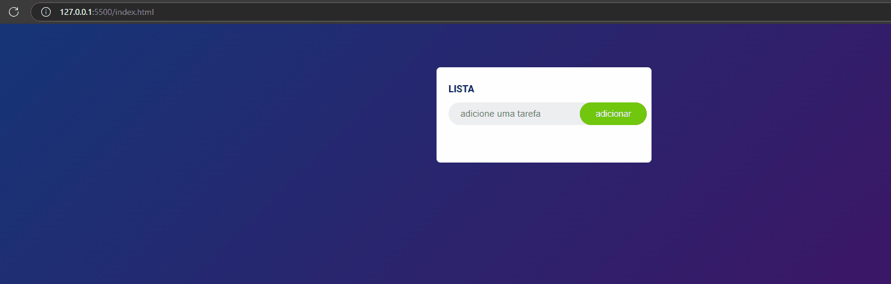

# Projeto

## Sobre
Projeto desenvolvida atraves de um video do youtube no canal do GreatStack, um desque muito importante enquanto estava codando junto foi perceber o uso do creatElement que ate o momento nao tinha visto, estarei estudando mais a fundo a respeito.  
let span = document.createElement('span').
